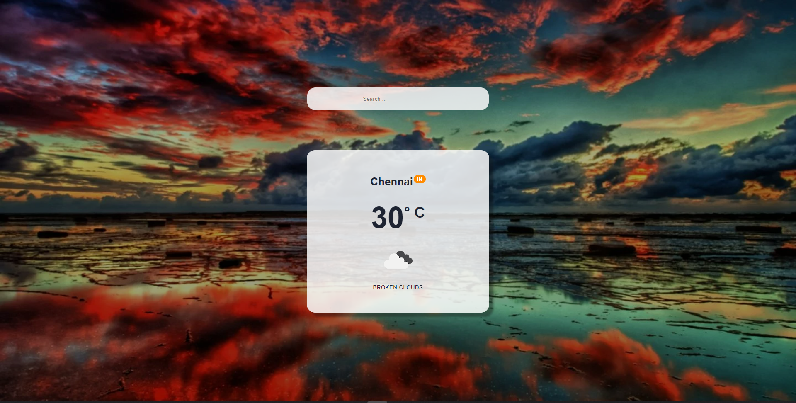
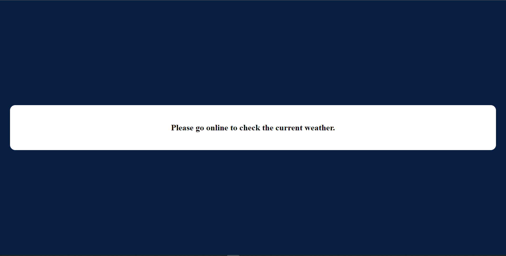

    updated: Sunday, 17th July 2022

    
    
 A sunny day is a happy day 

    

# [Weatherify](https://weatherify-pritam.netlify.app)

## What's new?

- Everything 🌟⭐🌠

## Table of Contents

- [Introduction](#introduction)
- [Featues](#features)
- [Tech Stack Used](#tech-stack-used)
- [Previews](#previews)
- [Demo](#demo)
- [License](#license)

---

## Introduction

- A really nice weather app built with react.
- This application is a Progressive Web App

---

## Features

- Minimalist UI
- Displays Weather of any Location with nice card component
- Installable in Mobile and Desktops
- Instant and Fully responsive

---

## Tech Stack Used

- Html
- Css
- Axios
- NodeJS
- React
- Netlify
- Open Weather API

    

---

## Previews

- Desktop Preview

- Mobile Preview

- User Details:

---

## Upcomming

- Make it better

---

## License

- see [LICENSE]

**Pritam, 2022**

[license]: https://github.com/warmachine028/weatherify/blob/main/LICENSE